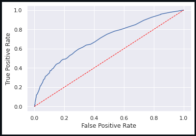
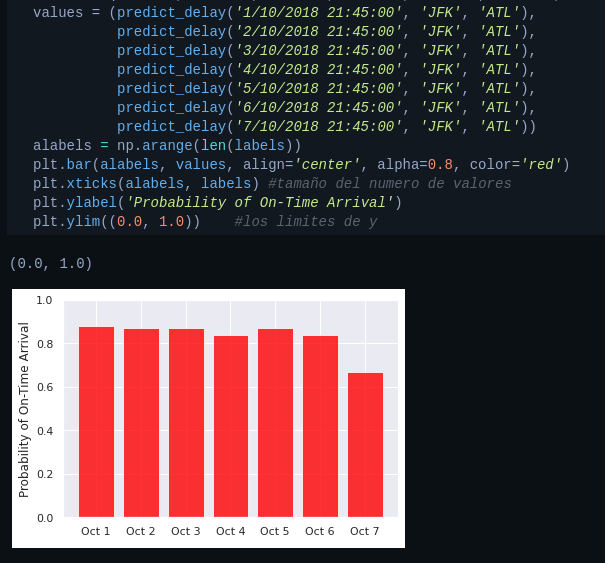

# My first step with machine learning

Small introduction to machine learning, predicting flight delays by creating an automatic learning model in Python

## Introduction

Python is one of the most popular programming languages in the world. It is widely used in the data science community for machine learning and statistical analysis. One of the reasons for its popularity is the availability of thousands of open source libraries, such as NumPy, Pandas, Matplotlib, and Scikit-learn, allowing researchers and programmers to explore, transform, analyze, and visualize data.

In this module, you will import a dataset containing information about the timeliness of arrivals from a U.S. airline and load the dataset into the notebook. Then, you will clean the dataset with Pandas, create a Machine Learning model with Scikit-learn and use Matplotlib to visualize the result of the model.

## Screenshots ⚙️

  

  

  

## Built with 🛠️

* Jupyter
* Python
* Pandas
* Matplotlib
* Scikit-learn

## Expressions of Gratitude 🎁

* Tell others about this project 🤓📢.

---
⌨️ with ❤️ by' Erik Garfia 😊
